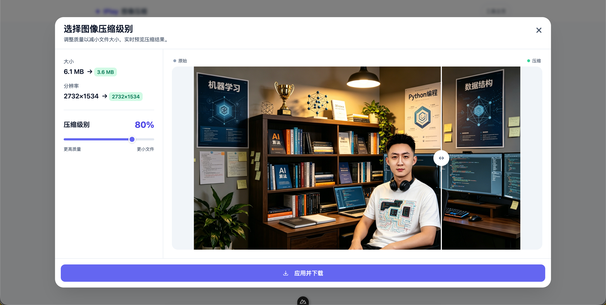

<p align="center">
	
</p>

<p align="center">
	<a href="LICENSE"></a>
	
	
	
</p>

<p align="center">
	<a href="https://github.com/Geekmister/
IPlay-Compression/stargazers"></a>
	<a href="https://github.com/Geekmister/
IPlay-Compression/network/members"></a>
	<a href="https://github.com/Geekmister/
IPlay-Compression/issues"></a>
	<a href="https://github.com/Geekmister/
IPlay-Compression/commits"></a>
	
	<a href="https://github.com/Geekmister/
IPlay-Compression/releases"></a>
</p>

<p align="center">	<a href="README.zh-CN.md">
		
	</a>
</p>

<p align="center">
	A pure front-end, locally-running image compression toolbox.No image uploads, no reliance on the backend. It turns the compression tasks of frequently used images into an easily accessible entry point for quick operation.
</p>

---



> The human in the picture is mine.

## Core Features

| Emoji | Feature | Description |
|---|---|---|
| 🔒 | Zero Backend Dependency | All image processing runs 100% locally in browser memory, your images never leave your device |
| 📤 | Drag & Drop Upload | Support 3 upload methods: drag & drop, paste screenshot, click to select |
| 👀 | Real-time Preview | Side-by-side comparison slider, drag to view before/after compression difference instantly |
| 🎚️ | Quality Adjustment | Visual slider to adjust compression quality with immediate preview |
| 📷 | Multi-format Support | Native support for JPG / PNG / WEBP 3 mainstream image formats |
| 📦 | Large File Support | Single file up to 50MB ultra-large image |
| 💾 | One-click Download | Export compressed image directly to local, no server waiting required |
| 🎛️ | Dark Console Style | Developer-oriented toolbench UI, comfortable for long time usage |

## Quick Start

1. Enviroment Requirements
    - Node.js >= 18.x
    - Nuxt 3 Runtime Environment
2. Instasll Dependencies
    ```bash
    yarn install
    ```
3. Launch development server
    ```bash
    yarn dev
    ```
4. Vist [Lcoal address](http://localhost:3000) to use
5. Production build
    ```bash
    yarn build
    ```
6. Preview production build
    ```bash
    yarn preview
    ```

## Project Structure
```markdown
IPlay-Compression/
├── app/
│   ├── app.vue
│   └── assets/
│       └── css/
│           └── main.css
├── docs/
│   └── v1.0.0迭代（MVP）.md
├── LICENSE
└── README.md
```

## Contributing

We welcome all kinds of contributions! Please follow these guidelines to make your contribution smooth:

### 🐛 Report Issues
- Before submitting a new issue, please search to avoid duplicates
- Clearly describe the problem, reproduction steps and expected behavior
- Attach screenshots and environment information if possible

### 🚀 Submit Pull Requests
1. Fork this repository and create a new branch from `develop`
2. Follow Conventional Commits specification for your commit messages
3. Make sure your code passes all lint checks and tests
4. Update relevant documentation if you change features
5. Submit PR to the `develop` branch, not `main`

### 🎨 Code Style
- Use Vue 3 Composition API with `<script setup>` syntax
- Follow ESLint and Prettier rules included in the project
- Keep components small and focused on single responsibility
- Write meaningful variable and function names in English

### 📝 Commit Convention
We strictly follow [Conventional Commits](https://www.conventionalcommits.org/):
- `feat`: New feature
- `fix`: Bug fix
- `docs`: Documentation changes
- `style`: Formatting changes
- `refactor`: Code refactoring
- `perf`: Performance improvement
- `test`: Test related changes
- `chore`: Build/tooling/maintenance changes

## Real-time trend dashboard

<p align="center">
	<a href="https://star-history.com/#Geekmister/IPlay&Date">
		
	</a>
</p>

<p align="center">
	
</p>

<p align="center">
	<a href="https://github.com/Geekmister/IPlay/graphs/contributors"></a>
</p>

## License

[MIT License](LICENSE)

