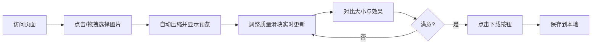

# v1.0.0迭代（MVP）
这是一个专为 **H5响应式网站** 设计的 **图片压缩工具 v1.0.0（MVP）产品规划**，**核心原则：功能单一、开箱即用、零隐私风险（纯前端）、移动端优先**。

## 一、产品定位与目标
> **一句话描述**：一个无需上传服务器、在手机/电脑浏览器上即可快速压缩图片的免费工具。
>

**目标用户**：

+ 需要压缩图片以节省手机空间、上传更快的普通用户
+ 运营、小编、电商卖家（快速压缩商品图）
+ 前端开发/测试人员（验证压缩效果）

**成功指标（MVP阶段）**：

+ 用户完成一次压缩全流程 ≤ 3 步
+ 压缩后图片与原图视觉差异可接受（默认质量 80%）
+ 页面加载时间 < 1.5s（4G 网络下）
+ 无后端请求，无图片上传服务器

## 二、v1.0.0 核心功能范围（必须做）
| 功能模块 | 具体能力 | 优先级 |
| --- | --- | --- |
| 图片选择 | 点击 / 拖拽 / 从相册选择（移动端） | P0 |
| 实时压缩 | 纯前端压缩（Canvas / Browser Image Compression API） | P0 |
| 压缩参数控制 | 仅提供 **压缩质量滑块（0.1 - 1.0）**，默认 0.8 | P0 |
| 结果预览 | 原图 vs 压缩图并排或切换显示 | P0 |
| 文件信息展示 | 文件名、原始尺寸/大小、压缩后大小、压缩率 | P0 |
| 下载功能 | 一键下载压缩后的图片（保留原格式） | P0 |
| 响应式布局 | 手机、平板、PC 自适应（Flex/Grid + 视口设置） | P0 |
| 错误提示 | 不支持格式、文件过大（>50MB）、压缩失败提示 | P1 |

### 明确不做的（留待后续版本）
+ ❌ 批量压缩（v2.0）
+ ❌ 自定义输出尺寸（v1.2）
+ ❌ WebP / 格式转换（v1.3）
+ ❌ 历史记录 / 对比滑块（v1.4）
+ ❌ 用户登录 / 云端保存

## 三、技术选型建议（纯前端）
| 层 | 技术方案 |
| --- | --- |
| 框架 | Nuxt + HTML5 + Tailwind |
| 压缩核心 | `BrowserImageCompressor` 或 `canvas.toBlob` + `JPEG/PNG quality` 参数 |
| 兼容处理 | 优先使用 `createImageBitmap` + OffscreenCanvas（性能好），降级 `Image` 对象 |
| 响应式 | CSS clamp() / 媒体查询 + viewport meta |
| 部署 | 静态托管（GitHub Pages / 腾讯云私有化部署） |

> 关键点：**完全在浏览器内存/本地完成**，用户无隐私担忧，也无需后端服务器费用。
>

---

## 四、用户体验流程（MVP）

**移动端关键交互**：

+ 点击上传区域自动唤起相册/文件选择器
+ 滑块足够大（44pt 点击区域）
+ 压缩完成后显示保存提示，并提供“复制压缩后大小”快捷功能（可选）

---

## 五、非功能需求（MVP底线）
| 维度 | 要求 |
| --- | --- |
| 性能 | 压缩 10MB 图片 ≤ 2 秒（中端手机） |
| 兼容性 | iOS Safari (14+)、Android Chrome (100+)、桌面 Chrome/Firefox/Edge |
| 最大文件 | 限制 50MB（避免内存溢出） |
| 隐私 | 无任何埋点/上传/第三方脚本（除可能 CDN） |
| 可访问性 | 按钮有 ARIA 标签，支持键盘操作（桌面） |

---

## 六、里程碑与交付计划（建议 2 天内）
| 阶段 | 时间 | 交付内容 |
| --- | --- | --- |
| D1 | 需求确认 | 原型图（手机+桌面线框图）、技术选型定型 |
| D1 | 核心开发 | 图片选择 + 压缩引擎 + 基础 UI |
| D1 | 功能完善 | 滑块控制、信息展示、下载、错误处理 |
| D2 | 响应式 + 兼容测试 | 5 种机型 / 4 种浏览器实测 |
| D2 | 优化 & 发布 | 加载性能、压缩算法调优、部署上线 |

---

## 七、风险与应对
| 风险 | 概率 | 应对方案 |
| --- | --- | --- |
| 大图片压缩后仍超出用户预期（比如还是很大） | 中 | 显示“建议调低质量”提示 + 提供 <50% 推荐 |
| iOS 上压缩后图片旋转 | 高 | 检测 EXIF 方向并自动纠正（增加 1 天开发） |
| 用户反复压缩同一张图导致性能卡顿 | 低 | 增加“重置”按钮，释放 Blob URL |
| 某些 PNG 压缩后反而变大 | 中 | 检测并提示“该图片可能已高度压缩，效果不明显” |

---

## 八、后续版本迭代方向（仅供规划）
+ **v1.1**：增加“保持原尺寸压缩” / “最大宽度限制”  
+ **v1.2**：支持 WebP 输出（高压缩比）  
+ **v1.3**：简单批量（3-5 张）  
+ **v1.4**：压缩历史记录（基于 IndexedDB）

## 九、视觉规范
### 设计原则（继承 + 精简）
+ **单任务专注**：所有视觉元素围绕“上传 → 调节 → 对比 → 下载”展开
+ **操作即所得**：滑块移动，压缩图和统计数据立刻更新（防抖 100ms）
+ **隐私可视化**：页面底部固定显示 “🔒 所有处理在本地完成，图片不上传”
+ **移动优先**：单列布局，桌面端扩展为两列对比

### 2. 颜色体系（基于 Tailwind）
| 用途 | 颜色 | Tailwind 类 |
| --- | --- | --- |
| 页面背景 | `#F8FAFC` | `bg-slate-50` |
| 卡片背景（毛玻璃） | `rgba(255,255,255,0.8)` + 模糊 12px | `bg-white/80 backdrop-blur-md` |
| 主按钮（上传/下载） | `#3B82F6` | `bg-blue-500 hover:bg-blue-600` |
| 成功状态（压缩率 >30%） | `#10B981` | `text-emerald-600` |
| 警告（压缩率不佳） | `#F59E0B` | `text-amber-600` |
| 危险/错误 | `#EF4444` | `text-red-500` |
| 滑块轨道填充 | `#3B82F6` 渐变 | `from-blue-400 to-blue-600` |
| 主要文字 | `#0F172A` | `text-slate-900` |
| 次要文字 | `#475569` | `text-slate-600` |
| 辅助文字 | `#94A3B8` | `text-slate-400` |
| 上传区虚线边框 | `#CBD5E1` | `border-slate-300` |
| 拖拽经过时边框 | `#3B82F6` | `border-blue-500` |

### 3. 字体系统
| 层级 | 字号/行高 | 字重 | 使用场景 |
| --- | --- | --- | --- |
| 页面主标题 | 28/36px | 700 | “图片压缩工具” |
| 卡片标题 | 18/26px | 600 | “原图” / “压缩后” |
| 按钮文字 | 16/24px | 500 | 上传、下载 |
| 文件信息 | 13/20px | 400 | 文件名、尺寸、大小 |
| 压缩率数字 | 20/28px | 700 | 展示压缩百分比 |
| 辅助/提示 | 12/18px | 400 | 隐私说明、错误提示 |

+ 字体栈：`system-ui, -apple-system, 'Inter', 'Segoe UI', sans-serif`

### 4. 间距与布局（4px 基础单位）
**页面最大宽度**：`1280px`，居中 `mx-auto`

**移动端（<640px）**：

+ 页面内边距：`16px`
+ 卡片间距：`20px`
+ 卡片内边距：`20px`
+ 对比区：上下排列，每个卡片占满宽

**桌面端（≥768px）**：

+ 页面内边距：`24px`
+ 卡片间距：`24px`
+ 卡片内边距：`24px`
+ 对比区：左右 1:1 排列，中间间隙 `24px`

### 5. 圆角与阴影
| 元素 | 圆角 | 阴影 |
| --- | --- | --- |
| 主卡片 | `24px` (`rounded-2xl`) | `0 10px 25px -5px rgba(0,0,0,0.05), 0 8px 10px -6px rgba(0,0,0,0.02)` |
| 按钮 | `12px` (`rounded-lg`) | 无阴影，hover 时轻微上浮 |
| 上传区 | `20px` (`rounded-xl`) | 无阴影，拖拽时增加 `shadow-md` |
| 滑块 | 轨道圆角 `9999px`，滑块圆角 `9999px` | — |

### 6. 关键组件状态视觉
#### 上传区（DropZone）
| 状态 | 边框 | 背景 | 图标 | 文字 |
| --- | --- | --- | --- | --- |
| 默认 | 2px 虚线 `#CBD5E1` | 透明 | 云上传图标（灰色） | “点击或拖拽上传图片” |
| 拖拽悬停 | 2px 实线 `#3B82F6` + 微光晕 | `bg-blue-50/30` | 图标变蓝 | “松开以上传” |
| 压缩中 | 2px 虚线 `#94A3B8` | 半透明遮罩 | 转圈加载图标 | “压缩中…” |
| 完成 | 2px 实线 `#10B981` | `bg-emerald-50/20` | 缩略图 | 显示文件名 |

#### 压缩质量滑块
+ 宽度：占满父容器
+ 轨道高：`4px`，背景 `#E2E8F0`，填充部分 `#3B82F6`（动态）
+ 滑块圆：`16px`，白色，带微阴影，悬浮放大 1.1 倍
+ 左侧显示标签：“压缩质量”，右侧实时数值：“80%”
+ 触摸目标：44x44px

#### 原图/压缩图对比卡片
每个卡片内包含：

+ 图片预览区（背景 `#F1F5F9` 极浅灰，圆角 `16px`）
+ 文件名（省略号处理）
+ 尺寸（宽 x 高）
+ 文件大小（KB/MB，小数点后 1 位）
+ 压缩图额外展示压缩率（绿色/橙色）

#### 下载按钮
+ 默认：`bg-blue-500`，白色文字，圆角 `12px`，内边距 12px 24px
+ 有压缩结果时：增加 `shadow-md` + 轻微脉冲动画（一次）
+ 无压缩结果：`bg-slate-300`，禁用点击
+ 点击后：缩放 0.97，恢复后显示 “已下载” 1 秒（通过 Toast 提示）

#### 错误/警告提示
+ 位置：上传区下方，与滑块同宽
+ 背景：`#FEF2F2`（红）或 `#FFFBEB`（黄），圆角 `12px`，内边距 12px
+ 图标 + 文字：例如 “⚠️ 图片大小超过 50MB，请选择更小的文件”
+ .自动消失？不自动，需要用户重新上传或操作后清除

### 7. 动画与过渡
| 场景 | 时长 | 缓动 | 效果 |
| --- | --- | --- | --- |
| 滑块拖动时压缩更新 | 防抖 100ms + 200ms 过渡 | `ease-out` | 预览图平滑替换 |
| 按钮点击 | 100ms | `ease` | 缩放 0.97 再复原 |
| 拖拽悬停高亮 | 150ms | `ease-in-out` | 边框颜色渐变 + 背景淡入 |
| 加载转圈 | 持续旋转 | `linear` | 无限旋转 |
| 成功提示（Toast） | 淡入 200ms，停留 2000ms，淡出 200ms | `ease` | — |

+ 所有动画需遵循 `prefers-reduced-motion`，降级为 0ms 或仅淡入淡出。

### 8. 响应式细节补充
+ 移动端（<640px）：
    - 滑块数值放在滑块下方（右对齐改为换行）
    - 压缩率数字加大加粗，占据一行
    - 下载按钮宽度 100%
+ 平板（640px - 1023px）：
    - 对比卡片内部图片预览区固定比例（4:3）
+ 桌面（≥1024px）：
    - 卡片内图片预览区固定高 280px，宽自适应
    - 鼠标悬浮卡片时阴影加深

### 9. 无障碍与细节
+ 所有按钮有 `aria-label`
+ 滑块有 `aria-valuemin/max/now` 和实时语音反馈（可选）
+ 对比图片的 alt 属性为 “原图预览” / “压缩后预览”
+ 键盘 Tab 顺序：上传区 → 滑块 → 下载按钮

